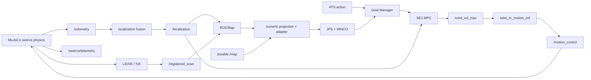

<div align="center">

# 🧪 ATS MUJOCO SIMULATION

**ATS 四驱四转舵轮底盘、LiDAR/ToF、静态场地图和 Nav2-free 导航闭环的 ROS 2 MuJoCo 仿真仓库**

<p>
  
  
  
  
</p>

<p>
  
  
  
</p>

<p>
  
  
  
</p>

</div>

---

> 正式 MuJoCo 闭环使用 ATS action、ROGMap adapter、JPS/MINCO、Goal Manager 和
> 全向 SE2 MPC，不启动 Nav2 map server、costmap、lifecycle server 或 `/plan`。

## 项目简介

`ats_mujoco_sim` 提供四舵轮动力学、转向/驱动执行器、接触、传感器、定位输入、底盘协议
bridge、RMUC 2026 场景、RViz 诊断和闭环回归入口。它用于验证从仿真传感器到
`/motion_control` 的完整软件链，而不仅是展示模型运动。

仓库支持：

- MuJoCo viewer 交互观察；
- 无 viewer/headless 自动回归；
- 与 headless 相同路线下启动完整导航 RViz；
- 独立 ROS domain 的 rectangle、red_box 与 P2/P3 故障注入；
- 最终位置、横移、规划 generation、离散碰撞、接触计数、速度 owner 和零命令验收。

## 目录

- [技术亮点](#技术亮点)
- [功能模块](#功能模块)
- [系统依赖](#系统依赖)
- [Quick Start](#quick-start)
- [启动方式](#启动方式)
- [导航目标与回归](#导航目标与回归)
- [接口与 QoS](#接口与-qos)
- [Launch 参数](#launch-参数)
- [数据流与所有权](#数据流与所有权)
- [RViz 可视化](#rviz-可视化)
- [验证结果与限制](#验证结果与限制)
- [目录结构](#目录结构)
- [致谢与许可证](#致谢与许可证)

## 技术亮点

### 四驱四转舵轮动力学

MuJoCo 模型分别描述四个 drive actuator、四个 steer actuator、自由车体和场地接触。
底盘控制保持车体系 `[vx, vy, wz]` 三自由度，可直接验证横移；不会把四舵轮退化为差速模型。

仿真节点实现 steering rate、wheel speed/acceleration 限制、command timeout、急停和反馈发布，
并通过 `SwerveTelemetry` 暴露目标/实际轮速、转角、估计底盘命令与接触违规计数。

### LiDAR、ToF 与定位输入

内置 MID-360 扫描模式和 CPU LiDAR backend，输出 `/local_pointcloud` 与
`/registered_scan`。可选 ToF 输出左右和 merged point cloud。MuJoCo truth odometry 与
localization fusion 为 ROGMap、Goal Manager 和 MPC 提供仿真定位输入。

CPU 是正式回归默认 backend；JAX/Taichi backend 为可选加速路径，只有选择对应 backend
时才需要安装其额外依赖。

### 静态图与场景坐标一致性

`static_map_publisher` 读取 ROS map YAML 和 PGM/PNG，保留 resolution、origin、origin yaw、
occupied/free/unknown 与图像 Y 轴翻转语义，并用 RELIABLE + TRANSIENT_LOCAL 发布 `/map`。
RMUC 2026 heightfield、墙体 collision boxes 和规划地图来自同一场地资产，减少视觉模型与
规划图错位。

### Nav2-free 闭环编排

`rmuc_2026_mujoco.launch.py` 直接编排：

```text
MuJoCo sensors -> localization fusion -> ROGMap -> adapter
-> JPS/MINCO -> Goal Manager -> SE2 MPC
-> /cmd_vel_mpc -> twist_to_motion_ctrl -> /motion_control -> MuJoCo
```

正式 launch 显式把 `twist_to_motion_ctrl.input_topic` 覆盖为 `/cmd_vel_mpc`；类内遗留的
standalone 默认字符串不属于正式运行配置。

## 功能模块

| 模块 | 入口 | 说明 |
| :--- | :--- | :--- |
| 物理仿真 | `ats_mujoco_sim` | 加载 XML、执行 MuJoCo step、接收底盘命令、发布状态与接触 telemetry |
| 四舵轮运动学 | `ats_mujoco_sim/kinematics.py` | `[vx, vy, wz]` 到四轮 drive/steer 目标及反馈估计 |
| LiDAR/ToF | `mujoco_lidar/`、`mid360_model.py` | CPU/JAX/Taichi ray casting、Livox 扫描模式和点云发布 |
| 静态地图 | `static_map_publisher` | 发布带原始地图几何和 durability 的 `/map` |
| 速度 bridge | `twist_to_motion_ctrl` | `/cmd_vel_mpc` 到 `manda_can_control/msg/MotionCtrl` |
| 场地资产 | `models/`、`maps/` | RMUC 2026 chassis、mesh、heightfield、wall collisions、map |
| 资产生成 | `generate_*`、`refine_*`、`patch_*` | 地形、场景、墙体和导航图生成/修正工具 |
| 导航编排 | `rmuc_2026_mujoco.launch.py` | static map、ROGMap、adapter、MINCO、Goal Manager、MPC、RViz |
| 回归入口 | 根仓 `scripts/test_mujoco_minco_mpc_chain.sh` | 路线、owner、终点、安全停机与故障恢复验收 |

## 系统依赖

### 基础环境

- Ubuntu 22.04；
- ROS 2 Humble；
- Python 3 与 `ament_python`；
- MuJoCo Python package；
- NumPy、SciPy、Pillow、PyYAML；
- 工作区内 `ats_sentry_bringup`、ROGMap、MINCO、Goal Manager、MPC；
- `manda_can_control`、`carstatemsgs` 与 ATS navigation interfaces。

安装 ROS 可解析依赖：

```bash
cd /home/ats/ATS_2026_snetry_test
source /opt/ros/humble/setup.bash
rosdep install --from-paths src --ignore-src -r -y
```

安装 Python 仿真依赖：

```bash
python3 -m pip install --user mujoco numpy scipy Pillow PyYAML
```

可选 backend：

```bash
python3 -m pip install --user jax       # 仅 lidar_backend:=jax
python3 -m pip install --user taichi    # 仅 lidar_backend:=taichi/ti
```

生产或 CI 环境建议使用锁定版本的虚拟环境/镜像；本仓当前未提供 Python lockfile，README
不声明一个未经验证的固定版本组合。

## Quick Start

### 正式工作区构建

```bash
cd /home/ats/ATS_2026_snetry_test
source /opt/ros/humble/setup.bash
MAKEFLAGS=-j1 colcon build --base-paths src --symlink-install \
  --packages-up-to ats_mujoco_sim \
  --parallel-workers 1
source install/setup.bash
```

必须使用 `--base-paths src`；单独执行 Python 或 CMake 语法检查不等价于 ROS 包级构建。

### 检查 Launch 参数

```bash
ros2 launch ats_mujoco_sim rmuc_2026_mujoco.launch.py --show-args
```

## 启动方式

每次独立实验建议选择未被其他 ROS 进程使用的 `ROS_DOMAIN_ID`，并禁用 ros2 daemon：

```bash
export ROS_DOMAIN_ID=231
export ROS2CLI_DISABLE_DAEMON=1
source /opt/ros/humble/setup.bash
source /home/ats/ATS_2026_snetry_test/install/setup.bash
```

### MuJoCo Viewer

```bash
ros2 launch ats_mujoco_sim rmuc_2026_mujoco.launch.py \
  use_viewer:=true \
  show_viewer:=true \
  use_rviz:=false
```

`use_viewer` 控制 viewer 进程，`show_viewer` 控制窗口显示。远程或无 DISPLAY 环境不要启用。

### Headless 闭环

```bash
ros2 launch ats_mujoco_sim rmuc_2026_mujoco.launch.py \
  use_viewer:=false \
  show_viewer:=false \
  use_rviz:=false
```

这是自动化回归推荐模式，仍会运行物理、传感器、地图、规划、控制和底盘 bridge。

### 完整导航 RViz

```bash
ros2 launch ats_mujoco_sim rmuc_2026_mujoco.launch.py \
  use_viewer:=false \
  show_viewer:=false \
  use_rviz:=true
```

`use_rviz:=true` 加载 `rviz/mujoco_navigation.rviz`，展示 ROGMap、planning grid、MINCO 和
MPC 诊断。`launch_mujoco_rviz:=true` 则是 sim-only 轻量观察视图，一般不要与完整导航 RViz
同时打开。

### 兼容入口

```bash
ros2 launch ats_mujoco_sim mujoco_navigation.launch.py
```

该文件仅转发到 `rmuc_2026_mujoco.launch.py`，不代表存在另一套 Nav2 编排。

## 导航目标与回归

### 手工发送目标

```bash
ros2 action send_goal --feedback \
  /ats_navigate_to_pose \
  ats_navigation_interfaces/action/NavigateToPose \
  "{goal_pose: {header: {frame_id: map}, pose: {position: {x: -9.50, y: 1.47, z: 0.0}, orientation: {w: 1.0}}}, timeout: {sec: 60, nanosec: 0}}"
```

### Rectangle 横移回归

```bash
ROS_DOMAIN_ID=186 \
PLANNING_GRID_OWNER=rog_map \
TEST_PROFILE=rectangle \
GOAL_TIMEOUT=180 \
scripts/test_mujoco_minco_mpc_chain.sh
```

rectangle 保持 yaw 为 0，south/north 两段必须产生非零 `linear.y`，用于阻止控制链静默退化
成差速运动。

### Rectangle + RViz

```bash
ROS_DOMAIN_ID=184 \
PLANNING_GRID_OWNER=rog_map \
TEST_PROFILE=rectangle \
USE_RVIZ=true \
GOAL_TIMEOUT=180 \
scripts/test_mujoco_minco_mpc_chain.sh
```

### Red Box 长路线

```bash
ROS_DOMAIN_ID=187 \
PLANNING_GRID_OWNER=rog_map \
TEST_PROFILE=red_box \
GOAL_TIMEOUT=180 \
scripts/test_mujoco_minco_mpc_chain.sh
```

### P2/P3 故障注入

P2 支持：

```text
adapter_lease  service_timeout  input_stale  unknown  unreachable
```

P3 支持：

```text
cancel  preempt  timeout  tf_failure
```

示例：

```bash
ROS_DOMAIN_ID=215 \
PLANNING_GRID_OWNER=rog_map \
P2_FAULT_CASE=service_timeout \
scripts/test_mujoco_minco_mpc_chain.sh

ROS_DOMAIN_ID=220 \
PLANNING_GRID_OWNER=rog_map \
P3_FAULT_CASE=preempt \
scripts/test_mujoco_minco_mpc_chain.sh
```

每个 fault case 必须使用新的 `ROS_DOMAIN_ID` 和新的 MuJoCo launch，不能在同一仿真进程中
串行注入多个故障后宣称独立通过。验收至少包括：

```text
emergency_stop=true -> /cmd_vel_mpc=0 -> /motion_control=0
```

可恢复故障还要验证 generation 前进，且未提交新 goal 时旧执行授权/reference 不复活。

## 接口与 QoS

### 传感器、状态和控制 Topic

| Topic | 类型 | producer -> consumer | 语义/QoS |
| :--- | :--- | :--- | :--- |
| `/odometry` | `nav_msgs/msg/Odometry` | MuJoCo -> localization fusion | 仿真 truth/里程计输入 |
| `/localization` | `nav_msgs/msg/Odometry` | localization fusion -> ROGMap/Goal Manager/MPC/RViz | 运行期已核对 BEST_EFFORT consumer compatibility |
| `/local_pointcloud` | `sensor_msgs/msg/PointCloud2` | LiDAR worker -> 诊断/感知 | 原始仿真 LiDAR |
| `/registered_scan` | `sensor_msgs/msg/PointCloud2` | LiDAR worker -> ROGMap/RViz | 运行期已核对 BEST_EFFORT consumer compatibility |
| `/perception/tof/points_merged` | `sensor_msgs/msg/PointCloud2` | ToF worker -> terrain/诊断 | 可选，默认 RMUC 闭环关闭 ToF |
| `/cmd_vel_mpc` | `geometry_msgs/msg/Twist` | `ats_swerve_mpc` -> `twist_to_motion_ctrl` | 车体系 `[vx, vy, wz]`；唯一 producer/bridge subscriber |
| `/motion_control` | `manda_can_control/msg/MotionCtrl` | `twist_to_motion_ctrl` -> MuJoCo | 唯一底盘输入 |
| `/planner/emergency_stop` | `std_msgs/msg/Bool` | Goal Manager -> MPC/MuJoCo | 急停 heartbeat |
| `/swerve/telemetry` | `ats_navigation_interfaces/msg/SwerveTelemetry` | MuJoCo -> test/evaluator | 轮速、舵角、命令和 contact diagnostics |
| `/gimbal/yaw_status` | `ats_navigation_interfaces/msg/GimbalYawStatus` | MuJoCo -> Goal Manager/MPC | RELIABLE + TRANSIENT_LOCAL |
| `/gimbal/yaw_authority_request` | `ats_navigation_interfaces/msg/YawAuthorityRequest` | Goal Manager -> MuJoCo | yaw authority 请求与确认链 |

### 底盘兼容接口

MuJoCo 还提供 `/speed_ctrl`、`/steer_ctrl`、`/motion_fb`、`/speed_fb`、`/steer_fb`、
`/system_state_fb`、`/battery_fb` 以及 `/motion_mode`、`/control_mode` service，用于底盘协议和
HIL 前的软件联调。正式自主导航的主输入仍是 `/motion_control`。

### 地图与规划接口

地图、projection、planning grid、ATS action、MINCO reference 和 `ExecutionCommand` 的完整
契约见导航仓 README。仿真不得从 `/rog_map/esdf` 可视化点云重建 planner 数值 ESDF。

## Launch 参数

`rmuc_2026_mujoco.launch.py` 的常用参数：

| 参数 | 默认值 | 说明 |
| :--- | :--- | :--- |
| `start_x/y/z/yaw` | `-10.66 / 1.47 / 0.42 / 0.0` | RMUC 2026 初始位姿，m/rad |
| `use_viewer` | `true` | 是否运行 MuJoCo viewer |
| `show_viewer` | `true` | 是否显示 viewer 窗口 |
| `use_rviz` | `false` | 是否启动完整导航 RViz |
| `launch_mujoco_rviz` | `false` | 是否启动 sim-only 轻量 RViz |
| `params_file` | 根仓 `node_params.yaml` | ROGMap、adapter、MINCO、Goal Manager、MPC 参数 |
| `map_yaml_file` | 根仓 RMUC 2026 map | static map 权威资源 |
| `sim_rate_hz` | `300.0` | MuJoCo step loop 目标频率 |
| `feedback_rate_hz` | `10.0` | 底盘反馈发布频率 |
| `truth_rate_hz` | `10.0` | odometry/truth 发布频率 |
| `command_timeout` | `0.5` | 底盘命令 stale timeout，s |
| `enable_lidar` | `true` | 启用 LiDAR worker |
| `lidar_backend` | `cpu` | `cpu` 或已安装的可选 backend |
| `lidar_downsample` | `24` | 射线/点云降采样 |
| `lidar_rate_hz` | `10.0` | LiDAR 发布频率 |
| `enable_tof` | `false` | RMUC 正式回归是否启用 ToF |
| `force_body_yaw_follow` | `false` | 固定测试 profile 的 yaw policy，不是运行时热切换 |
| `max_linear_x/y` | `1.0 / 1.0` | bridge 线速度限幅，m/s |
| `max_angular_z` | `2.0` | bridge 角速度限幅，rad/s |

`map_start_delay_sec`、`rog_map_start_delay_sec`、`nav_start_delay_sec` 用于启动排序；修改前要
验证 map、projection、localization 和 action ready 的实际时间，而不是只缩短等待值。

## 数据流与所有权



运行期必须验证：

- `/rc_esdf/planning_grid` 只有 adapter 一个 publisher；
- `/cmd_vel_mpc` 只有 MPC 一个 publisher，bridge 只有一个 subscriber；
- `/motion_control` 只有 bridge 一个 publisher，MuJoCo 只有一个 subscriber；
- localization fusion 是 `map -> odom` 唯一动态 TF owner；
- 停止、超时和故障后最终命令与四轮 RPM 回到零。

## RViz 可视化

完整配置：

```text
rviz/mujoco_navigation.rviz
```

包含：

- ROGMap occupied、inflated、unknown、bounds 和 ESDF 诊断；
- `/rc_esdf/planning_grid`；
- MINCO raw path、reference path；
- MPC reference horizon、predicted path；
- localization、TF、机器人位姿和传感器点云。

轻量 sim-only 配置：

```text
rviz/mujoco_sim_observe.rviz
```

最近 domain 184 运行工件已确认 ROGMap/定位 producer 与 RViz subscriber 为 BEST_EFFORT，
截图非黑且诊断层可见。RViz 启动早期可能出现短暂 QoS 初始化 warning，应以最终 endpoint 表和
实际数据为准；仍不能用“画面可见”代替闭环结果。

## 验证结果与限制

### 最近 S1/P4 准备阶段证据

| 场景 | Domain | 结果 |
| :--- | :--- | :--- |
| Rectangle + RViz | `184` | 五段最大终点误差 `0.038681 m`；generation `313 -> 1328` |
| Rectangle headless | `186` | 五段最大终点误差 `0.041613 m`；generation `309 -> 1264` |

两例均已验证：

- 五段 ATS action 完成；
- south/north 有非零 `vy` 横移；
- `/cmd_vel_mpc` 与 `/motion_control` owner 唯一；
- MINCO 离散 footprint collision sample 为 `0`；
- 最终 `/cmd_vel_mpc`、`/motion_control` 和四轮 RPM 为 `0`；
- telemetry `contact_violation_count=0`。

更早的 red_box 与 9 项 P2/P3 独立故障回归也已通过；故障均到达急停和双零输出。

### 不得越界的结论

- `contact_violation_count=0` 只覆盖现有 MuJoCo contact evaluator，不等价于物理零碰撞；
- 离散 footprint sample 为零不是连续 swept-volume 证明；
- MuJoCo wheel/ground/contact 参数尚不能替代实车制动距离、摩擦、延迟和负载测量；
- P4 `PlanningMapSnapshot`、`PlannerCandidate` 和 digest schema 已有 GTest，但
  adapter -> MINCO -> Goal Manager -> MPC -> serial 尚未端到端迁移；
- HIL、抬轮测试、受限低速实车和代表性实车路线尚未执行；
- 包级 lint 仍可能受既有 copyright/flake8/pep257 债务影响，定向物理/地图测试需单列结果。

## 目录结构

```text
ats_mujoco_sim/
├── ats_mujoco_sim/
│   ├── sim_node.py                 # MuJoCo ROS 2 主节点
│   ├── kinematics.py               # 四舵轮运动学、限幅和接触判据
│   ├── static_map_publisher.py     # durable static map
│   ├── twist_to_motion_ctrl.py     # Twist -> MotionCtrl bridge
│   ├── dynamic_obstacles.py        # 动态障碍场景逻辑
│   ├── terrain_assets.py           # 地形/地图/manifest 生成
│   └── rmuc_*.py                   # RMUC heightfield、墙体和导航图工具
├── mujoco_lidar/                   # CPU/JAX/Taichi LiDAR backend 与扫描模式
├── launch/
│   ├── ats_mujoco_sim.launch.py    # 物理与传感器底层入口
│   ├── rmuc_2026_mujoco.launch.py  # 正式 Nav2-free 闭环
│   └── mujoco_navigation.launch.py # 正式入口兼容转发
├── models/                         # chassis、RMUC scene、mesh、heightfield
├── maps/                           # RMUC ROS occupancy map
├── rviz/                           # 完整导航与 sim-only RViz
├── test/                           # static map 与 swerve physics 测试
├── package.xml
└── setup.py
```

## 致谢与许可证

感谢以下开源项目和社区：

| 项目 | 在本仓中的用途 | 上游 |
| :--- | :--- | :--- |
| MuJoCo | 刚体、关节、执行器、接触和 viewer | [google-deepmind/mujoco](https://github.com/google-deepmind/mujoco) |
| ROS 2 | 节点、Topic、Service、TF、launch 与测试工具 | [ros2/ros2](https://github.com/ros2/ros2) |
| NumPy | 运动学、地图和传感器数值处理 | [numpy/numpy](https://github.com/numpy/numpy) |
| SciPy | 几何变换、地图处理和分析工具 | [scipy/scipy](https://github.com/scipy/scipy) |
| Pillow | ROS map 和 heightfield 图像读写 | [python-pillow/Pillow](https://github.com/python-pillow/Pillow) |
| PyYAML | ROS map metadata 与场景配置解析 | [yaml/pyyaml](https://github.com/yaml/pyyaml) |
| JAX / Taichi | 可选 LiDAR backend | [jax-ml/jax](https://github.com/jax-ml/jax) / [taichi-dev/taichi](https://github.com/taichi-dev/taichi) |

本仓 package 许可证为 Apache-2.0。MuJoCo、ROS 2、NumPy、SciPy、Pillow、PyYAML、JAX、
Taichi 以及模型/mesh 的再分发条件以各上游许可证和资产声明为准。
