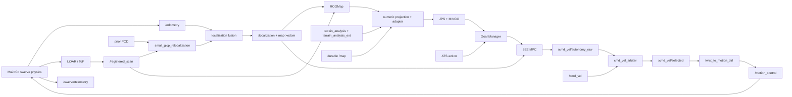

<div align="center">

# ATS MUJOCO SIMULATION

**ATS 四驱四转舵轮底盘、LiDAR/ToF、静态场地图和 Nav2-free 导航闭环的 ROS 2 MuJoCo 仿真仓库**

<p>
  
  
  
  
</p>

<p>
  
  
  
</p>

<p>
  
  
  
</p>

</div>

---

> 正式 MuJoCo 闭环使用 ATS action、ROGMap adapter、JPS/MINCO、Goal Manager 和
> 全向 SE2 MPC，不启动 Nav2 map server、costmap、lifecycle server 或 `/plan`。

## 项目简介

`ats_mujoco_sim` 提供四舵轮动力学、转向/驱动执行器、接触、传感器、定位输入、底盘协议
bridge、RMUC 场景、RViz 诊断和闭环回归入口。它用于验证从仿真传感器到
`/motion_control` 的完整软件链，而不仅是展示模型运动。

正式闭环当前使用 **RMUC 2025** 场地：`models/rmuc_2025_swerve.xml`、
`ats_sentry_bringup/map/rmuc_2025.yaml` 和 `ats_sentry_bringup/pcd/rmuc_2025.pcd`。
仓内 RMUC 2026 模型、heightfield 和 `maps/rmuc_2026.*` 仍保留为场地资产，但
`rmuc_2026_mujoco.launch.py` 目前只是转发到 `rmuc_2025_mujoco.launch.py` 的兼容入口。

仓库支持：

- MuJoCo viewer 交互观察；
- 无 viewer/headless 自动回归；
- 与 headless 相同路线下启动完整导航 RViz；
- 独立 ROS domain 的 single、rectangle、south_corridor、red_box 路线与 P2/P3 故障注入；
- 最终位置、横移、规划 generation、离散碰撞、接触计数、速度 owner 和零命令验收。

## 目录

- [技术亮点](#技术亮点)
- [功能模块](#功能模块)
- [系统依赖](#系统依赖)
- [Quick Start](#quick-start)
- [启动方式](#启动方式)
- [节点图与参数分层](#节点图与参数分层)
- [导航目标与回归](#导航目标与回归)
- [接口与 QoS](#接口与-qos)
- [Launch 参数](#launch-参数)
- [数据流与所有权](#数据流与所有权)
- [RViz 可视化](#rviz-可视化)
- [验证结果与限制](#验证结果与限制)
- [故障排查](#故障排查)
- [目录结构](#目录结构)
- [致谢与许可证](#致谢与许可证)

## 技术亮点

### 四驱四转舵轮动力学

MuJoCo 模型分别描述四个 drive actuator、四个 steer actuator、自由车体和场地接触。
底盘控制保持车体系 `[vx, vy, wz]` 三自由度，可直接验证横移；不会把四舵轮退化为差速模型。
底盘碰撞包络为实车 0.58 x 0.58 m（半尺寸 0.29 m），轮半径 0.0425 m。

仿真节点实现 steering rate、wheel speed/acceleration 限制、command timeout、急停和反馈发布，
并通过 `SwerveTelemetry` 暴露目标/实际轮速、转角、估计底盘命令与接触违规计数。

### LiDAR、ToF 与定位输入

内置 MID-360 扫描模式和 CPU LiDAR backend，输出 `/local_pointcloud` 与
`/registered_scan`（RMUC launch 中帧为 `odom`）。可选 ToF 输出左右和 merged point cloud。
MuJoCo 发布 `/odometry`，不发布 `map -> odom`；真实 `small_gicp_relocalization` 用
`/registered_scan` 与先验 PCD 配准并输出观测，`localization_fusion` 是 `map -> odom` 和
`/localization` 的唯一 owner，为 ROGMap、Goal Manager 和 MPC 提供定位输入。

CPU 是正式回归默认 backend；JAX/Taichi backend 为可选加速路径，只有选择对应 backend
时才需要安装其额外依赖。

### 静态图与场景坐标一致性

`static_map_publisher` 读取 ROS map YAML 和 PGM/PNG，保留 resolution、origin、origin yaw、
occupied/free/unknown 与图像 Y 轴翻转语义，并用 RELIABLE + TRANSIENT_LOCAL 发布 `/map`。
`rmuc_2025_swerve.xml` 用 heightfield 表达地形、用 `rmuc_2025_wall_boxes.xml` 表达墙体
collision；RMUC 2025 初始 `start_z=0.381` 按起点地面高度约 0.201 m 加轮底偏置 0.180 m
计算，保证轮子落在 hfield 上。

### Nav2-free 闭环编排

`rmuc_2025_mujoco.launch.py` 直接编排：

```text
MuJoCo sensors -> small_gicp_relocalization + localization_fusion
               -> terrain_analysis(_ext) + ROGMap -> adapter
-> JPS/MINCO -> Goal Manager -> ats_swerve_mpc
-> /cmd_vel/autonomy_raw -> cmd_vel_arbiter -> /cmd_vel/selected
-> twist_to_motion_ctrl -> /motion_control -> MuJoCo
```

正式 launch 显式把 MPC `command_topic` 设为 `/cmd_vel/autonomy_raw`，把 arbiter 的 autonomy 输入覆盖为
同一 topic（`node_params.yaml` 中实车默认为 `/cmd_vel/autonomy`），并显式绑定
`planner_status_topic=/minco/planning_status`、`map_ready_topic=/rog_map_adapter/ready`；
`twist_to_motion_ctrl.input_topic` 为 `/cmd_vel/selected`。MuJoCo 不启动 fake/chassis yaw 速度变换，
也没有串口链路，因此 arbiter 显式使用 `require_serial_link:=False`；自动源仍需要
`ExecutionCommand`，手动 `/cmd_vel` 可优先覆盖。键鼠到 `/motion_control` 的运行闭环与物理接触仍为
**未验证**；本 README 更新未重新运行 nominal/red_box/fault matrix。

## 功能模块

| 模块 | 入口 | 说明 |
| :--- | :--- | :--- |
| 物理仿真 | `ats_mujoco_sim` | 加载 XML、执行 MuJoCo step、接收底盘命令、发布状态与接触 telemetry |
| 四舵轮运动学 | `ats_mujoco_sim/kinematics.py` | `[vx, vy, wz]` 到四轮 drive/steer 目标及反馈估计 |
| LiDAR/ToF | `mujoco_lidar/`、`mid360_model.py` | CPU/JAX/Taichi ray casting、Livox 扫描模式和点云发布 |
| 静态地图 | `static_map_publisher` | 发布带原始地图几何和 durability 的 `/map` |
| 速度仲裁 | `ats_cmd_vel_arbiter` 包 `cmd_vel_arbiter_node` | `/cmd_vel` 与 `/cmd_vel/autonomy_raw` 到 `/cmd_vel/selected` |
| 速度 bridge | `twist_to_motion_ctrl` | `/cmd_vel/selected` 到 `manda_can_control/msg/MotionCtrl` |
| 场地资产 | `models/`、`maps/` | RMUC 2025/2026 chassis、mesh、heightfield、wall collisions；`maps/` 内为 RMUC 2026 图 |
| 资产生成 | `generate_*`、`refine_*`、`patch_*` | 地形、场景、墙体和导航图生成/修正工具 |
| 导航编排 | `rmuc_2025_mujoco.launch.py` | 物理、static map、GICP/fusion、地形分析、ROGMap、adapter、MINCO、Goal Manager、MPC、arbiter、RViz |
| 仿真 profile | `config/rmuc_2025_navigation.yaml` | 叠加在根仓 `node_params.yaml` 之上的 RMUC 仿真参数 |
| 回归入口 | 根仓 `scripts/test_mujoco_minco_mpc_chain.sh` | 路线、owner、终点、安全停机与故障恢复验收 |
| 曲率分析 | 根仓 `scripts/analyze_reference_curvature.py` | 从 rosbag 计算 MINCO reference 的弧长曲率指标 |

`ats_mujoco_sim` 包本身的 console scripts 只有 `ats_mujoco_sim`、`static_map_publisher`、
`twist_to_motion_ctrl` 和上表中的资产生成工具；LiDAR/ToF 在 `ats_mujoco_sim` 进程内发布，
没有独立的 LiDAR 发布节点。

## 系统依赖

### 基础环境

- Ubuntu 22.04；
- ROS 2 Humble；
- Python 3 与 `ament_python`；
- MuJoCo Python package；
- NumPy、SciPy、Pillow、PyYAML；
- 工作区内 `ats_sentry_bringup`（params、map、pcd）、ROGMap、adapter、MINCO、Goal Manager、
  MPC、`ats_cmd_vel_arbiter`；
- `terrain_analysis`、`terrain_analysis_ext`、`small_gicp_relocalization`；
- `manda_can_control`、`carstatemsgs` 与 ATS navigation interfaces。

安装 ROS 可解析依赖：

```bash
cd /home/ats/ATS_2026_snetry_test
source /opt/ros/humble/setup.bash
rosdep install --from-paths src --ignore-src -r -y
```

安装 Python 仿真依赖：

```bash
python3 -m pip install --user mujoco numpy scipy Pillow PyYAML
```

可选 backend：

```bash
python3 -m pip install --user jax       # 仅 lidar_backend:=jax
python3 -m pip install --user taichi    # 仅 lidar_backend:=taichi/ti
```

生产或 CI 环境建议使用锁定版本的虚拟环境/镜像；本仓当前未提供 Python lockfile，README
不声明一个未经验证的固定版本组合。

## Quick Start

### 正式工作区构建

```bash
cd /home/ats/ATS_2026_snetry_test
source /opt/ros/humble/setup.bash
MAKEFLAGS=-j1 colcon build --base-paths src --symlink-install \
  --packages-up-to ats_mujoco_sim \
  --parallel-workers 1
source install/setup.bash
```

必须使用 `--base-paths src`；单独执行 Python 或 CMake 语法检查不等价于 ROS 包级构建。

### 检查 Launch 参数

```bash
ros2 launch ats_mujoco_sim rmuc_2025_mujoco.launch.py --show-args
```

## 启动方式

每次独立实验建议选择未被其他 ROS 进程使用的 `ROS_DOMAIN_ID`（并行运行时取 `<= 101`，
原因见[故障排查](#故障排查)），并禁用 ros2 daemon：

```bash
export ROS_DOMAIN_ID=61
export ROS2CLI_DISABLE_DAEMON=1
source /opt/ros/humble/setup.bash
source /home/ats/ATS_2026_snetry_test/install/setup.bash
```

正式入口是 `rmuc_2025_mujoco.launch.py`。默认 `use_viewer:=true`、`show_viewer:=true`、
`use_rviz:=false`，即不带参数启动时会打开 MuJoCo viewer、不开 RViz。

### MuJoCo Viewer

```bash
ros2 launch ats_mujoco_sim rmuc_2025_mujoco.launch.py \
  use_viewer:=true \
  show_viewer:=true \
  use_rviz:=false
```

`use_viewer` 控制 viewer 进程，`show_viewer` 控制窗口显示。远程或无 DISPLAY 环境不要启用。

### Headless 闭环

```bash
ros2 launch ats_mujoco_sim rmuc_2025_mujoco.launch.py \
  use_viewer:=false \
  show_viewer:=false \
  use_rviz:=false
```

这是自动化回归推荐模式，仍会运行物理、传感器、地图、定位、规划、控制和底盘 bridge。

### 完整导航 RViz

```bash
ros2 launch ats_mujoco_sim rmuc_2025_mujoco.launch.py \
  use_viewer:=false \
  show_viewer:=false \
  use_rviz:=true
```

`use_rviz:=true` 在 `rviz_delay_sec`（默认 4.0 s）后启动 `mujoco_navigation_rviz2`，加载
`rviz_config_file`（默认 `rviz/mujoco_navigation.rviz`）。`launch_mujoco_rviz:=true` 会在物理侧
再启动一个 `ats_mujoco_sim_rviz2`，但 RMUC launch 把同一个 `rviz_config_file` 传给它，因此要看
sim-only 视图需同时指定 `rviz_config_file:=$(ros2 pkg prefix ats_mujoco_sim)/share/ats_mujoco_sim/rviz/mujoco_sim_observe.rviz`；
一般不要与完整导航 RViz 同时打开。

### 物理/导航分进程启动

```bash
ros2 launch ats_mujoco_sim rmuc_2025_physics.launch.py          # launch_navigation:=false
ros2 launch ats_mujoco_sim rmuc_2025_navigation_stack.launch.py # launch_physics:=false
```

两者都只是 include `rmuc_2025_mujoco.launch.py` 并固定 `launch_physics` / `launch_navigation`。

### 兼容入口

```bash
ros2 launch ats_mujoco_sim rmuc_2026_mujoco.launch.py
ros2 launch ats_mujoco_sim mujoco_navigation.launch.py
```

这两个文件都只转发到 `rmuc_2025_mujoco.launch.py`，不代表存在 RMUC 2026 闭环或另一套 Nav2 编排。
`planner_mujoco.launch.py` 是另一个 sim-only 入口：先按 `config/random_map.yaml` 生成随机地形，
再只启动 MuJoCo 底盘仿真，不包含导航栈。

## 节点图与参数分层

### Launch 启动的节点

`rmuc_2025_mujoco.launch.py` 中 `launch_physics:=true` 启动物理组，`launch_navigation:=true` 启动
导航组；导航组按 `TimerAction` 分批启动：

| 启动时机 | 节点名 | 包 / 可执行文件 | 参数来源 |
| :--- | :--- | :--- | :--- |
| 立即 | `ats_mujoco_sim` | `ats_mujoco_sim` / `ats_mujoco_sim`（经 `ats_mujoco_sim.launch.py`） | launch 参数 |
| `map_start_delay_sec` (1.0 s) | `static_map_publisher` | `ats_mujoco_sim` / `static_map_publisher` | launch 参数 |
| `nav_start_delay_sec` (6.0 s) | `terrain_analysis` | `terrain_analysis` / `terrainAnalysis` | `params_file` |
| 同上 | `terrain_analysis_ext` | `terrain_analysis_ext` / `terrainAnalysisExt` | `params_file` + 仿真 profile |
| 同上 | `localization_fusion` | `small_gicp_relocalization` / `localization_fusion_node` | 仅 launch 内联参数 |
| 同上 | `small_gicp_relocalization` | `small_gicp_relocalization` / `small_gicp_relocalization_node` | `params_file` + 内联；`launch_small_gicp_relocalization:=false` 可关 |
| 同上 | `ats_goal_manager` | `ats_goal_manager` / `ats_goal_manager_node` | `params_file` + 仿真 profile |
| 同上 | `minco_planner` | `minco_planner` / `minco_planner_node` | `params_file` + 仿真 profile + launch 的 yaw follow 参数 |
| 同上 | `ats_swerve_mpc` | `ats_swerve_mpc` / `ats_swerve_mpc_node` | `params_file` + 内联 |
| 同上 | `cmd_vel_arbiter` | `ats_cmd_vel_arbiter` / `cmd_vel_arbiter_node` | `params_file` + 内联 |
| 同上 | `twist_to_motion_ctrl` | `ats_mujoco_sim` / `twist_to_motion_ctrl` | 仅 launch 内联参数 |
| `rog_map_start_delay_sec` (12.0 s) | `ats_rog_map` | `ats_rog_map` / `ats_rog_map_node` | `params_file` + 仿真 profile |
| 同上 | `ats_rog_map_adapter` | `ats_rog_map_adapter` / `ats_rog_map_adapter_node` | `params_file` + 仿真 profile；仅 `planning_grid_owner == rog_map` |
| `rviz_delay_sec` (4.0 s) | `mujoco_navigation_rviz2` | `rviz2` | 仅 `use_rviz:=true` |

localization fusion 的内联参数包括 `odom_timeout_s=2.0`、`observation_timeout_s=3.0`、
`observation_lost_timeout_s=30.0`、`robot_base_frame=gimbal_yaw_odom`；GICP 在本 launch 中
`publish_tf=False`，只向 fusion 提供观测。

### 参数分层

同一节点的 `parameters` 列表按顺序加载，后者覆盖前者：

1. `params_file`，默认根仓 `src/ats_sentry_bringup/params/node_params.yaml`（实车 profile）；
2. `config/rmuc_2025_navigation.yaml`（安装后为 `share/ats_mujoco_sim/config/`），仅作用于
   `ats_rog_map`、`ats_rog_map_adapter`、`minco_planner`、`ats_goal_manager`、`terrain_analysis_ext`；
3. launch 内联字典（`use_sim_time`、topic 重绑定、`force_body_yaw_follow` 等）。

`ats_swerve_mpc`、`cmd_vel_arbiter`、`terrain_analysis`、`small_gicp_relocalization` 不加载仿真
profile。overlay 未写出的键沿用 `node_params.yaml`，两者都没写的键使用节点代码默认值。

### 仿真 overlay 对 `minco_planner` 的改动

“实车生效值”列取自 `node_params.yaml`；带 `*` 的是该文件未写出、取节点代码默认值。

| 参数 | 实车生效值 | 仿真 overlay | 说明 |
| :--- | :--- | :--- | :--- |
| `footprint_length/width` | `0.58 / 0.58` | `0.58 / 0.58` | 与 MuJoCo 碰撞包络一致 |
| `footprint_safety_margin` | `0.05` | `0.02` | 每边导航余量 |
| `obstacle_value_threshold` | `50` | `100` | 与 adapter `terrain_obstacle_value_threshold=100` 对齐 |
| `jps_safe_distance` | `0.54` | `0.44` | 全 yaw 半径 `hypot(0.31, 0.31) = 0.4384 m` |
| `yaw_mode` | `clearance_aware` | `clearance_aware` | 显式写出，节点代码默认是 `goal_heading` |
| `narrow_clearance_enter/exit` | `1.20 / 1.40` | `0.55 / 0.70` | 窄通道判定滞回 |
| `yaw_tangent_symmetry_order` | `2*` | `4` | 正方形足迹，切线 ±pi/2 也算对齐 |
| `yaw_narrow_gap_bridge_time` | `0.0*`（关闭） | `1.0` s | 两段窄通道间短间隙继续切线对齐 |
| `yaw_rate_limit` | `2.5` | `2.0` | 与 MPC `max_wz=2.0` 一致 |
| `yaw_acceleration_limit` | `0.0*`（关闭） | `3.0` | 与 MPC `max_awz=3.0` 一致 |
| `wheel_speed_time_scaling_limit` | `0.0*`（关闭） | `1.45` m/s | 约为 MPC `max_wheel_speed=1.669` 的 87%；offset_x/y `0.27`，change_rate `2.0` |
| `narrow_turn_speed_limit` | `0.0*`（关闭） | `0.8` m/s | 窄通道内 yaw_rate 绝对值 > 0.2 的点限速 |
| `terminal_yaw_relocation_*` | `true* / 6* / 1.0*` | `true / 6 / 1.00` | 与代码默认相同，仅显式化 |
| `escape_from_contact_enabled` | `false*` | `true`（depth `0.05`） | 只放行内缩 0.05 m 足迹下无冲突的擦边接触 |
| `local_repair_enabled` | `false` | `true`（search_radius `0.35 -> 0.50`） | Local Collision Repair |
| `goal_pose_admission_enabled` | `true*` | `true` | 容差 0.08 m / 0.15 rad，shrink 0.75 / 0.60 |
| `endpoint_clearance_relaxation_enabled` | `true*` | `true` | 与代码默认相同 |
| `retain_safe_reference_on_snapshot_change` | `false*` | `true`（horizon `4.0` s） | 新 snapshot 下剩余段仍过门禁则保留参考 |
| `guide_smoothing_iterations` | `0*`（关闭） | `80` | alpha 0.5，fidelity 0.02，max_deviation 0.50，min_clearance 0.44 |
| `joint_center_clearance` | `0.54` | `0.44` | 与 `jps_safe_distance` 对齐 |
| `joint_footprint_clearance` | `0.03` | `0.08` | 软罚目标，不是门禁 |
| `joint_footprint_edge_samples` | `1` | `4` | 每边采样点数 |
| `joint_time_budget_ms` | `15.0` | `50.0` | 其余 `joint_*` 与实车相同 |
| `footprint_yaw_refinement_rounds` | `2*` | `2` | 与代码默认相同 |
| `preprocessed_guide_topic` 等 3 个调试 topic | `""` | `/minco/preprocessed_guide`、`/minco/esdf_refined_guide`、`/minco/debug_markers` | 仅仿真发布中间阶段 |

对称阶数、间隙桥接、yaw 角加速度、轮速/窄通道时间缩放、接触逃逸、局部修复、参考保留和引导平滑
在实车 profile 中都是关闭或 fail-closed 的，只在本仿真 profile 打开，尚无实车验证。
同一 overlay 还把 `ats_goal_manager` 的 margin 设为 0.02、`ego_contact_max_depth=0.05`（实车 `0*`）、
`no_executable_plan_timeout_sec=30.0`、`progress_along_reference=true`（实车 `false*`）；把 adapter 投影高度
设为 `0.60..1.00`（实车 `0.25..0.95`）；把 ROGMap z 窗口扩到 `[-0.10, 1.90]`；把
`terrain_analysis_ext.planarVoxelSize/Width` 设为 `0.2 / 201`（实车 `0.4* / 101*`）、`traversabilityMinPointCount=2`（实车 3）。

## 导航目标与回归

### 手工发送目标

```bash
ros2 action send_goal --feedback \
  /ats_navigate_to_pose \
  ats_navigation_interfaces/action/NavigateToPose \
  "{goal_pose: {header: {frame_id: map}, pose: {position: {x: 10.36, y: 1.49, z: 0.0}, orientation: {w: 1.0}}}, timeout: {sec: 300, nanosec: 0}}"
```

该坐标是 red_box 单目标（RMUC 2025 中央高地北侧）；`timeout <= 0` 时使用 Goal Manager 默认值。

### 闭环验收脚本

根仓 `scripts/test_mujoco_minco_mpc_chain.sh` 在独立 domain 中以 headless 方式启动
`rmuc_2025_mujoco.launch.py`，下发 ATS action 目标，并检查 owner、终点误差、横移、零命令和
故障停机。启动前会校验关键二进制（arbiter、MPC、Goal Manager、MINCO、ROGMap、adapter、
`ats_rc_esdf`）与源码是否一致，失配时以退出码 3 结束，需要先重新构建。

| 环境变量 | 默认值 | 说明 |
| :--- | :--- | :--- |
| `ROS_DOMAIN_ID` | `88` | 必须是 `0..232` 的整数，否则退出码 2；并行运行建议 `<= 101` |
| `TEST_PROFILE` | `single` | `single`/`default`、`rectangle`、`south_corridor`、`red_box` |
| `GOAL_TIMEOUT` | `60` | 每个目标最长执行时间，s；red_box 未显式传入时为 `300` |
| `GOAL_TOLERANCE` | `0.30` | 终点平面误差门限，m（脚本注释提到 red_box 收紧到 0.15，但当前代码未实现，所有 profile 都是 0.30） |
| `USE_RVIZ` | `false` | `true` 时同一路线同时打开完整导航 RViz（`RVIZ_DELAY_SEC` 默认 18.0） |
| `PLANNING_GRID_OWNER` | `rog_map` | 当前只实现 `rog_map`；`rc_esdf` 会被拒绝 |
| `P2_FAULT_CASE` / `P3_FAULT_CASE` | `none` | 故障注入，见下文 |
| `START_X/Y/Z/YAW` | `-0.18 / 0.06 / 0.381 / 0.0` | 与 launch 默认一致 |
| `GOAL_X/Y/YAW` | `1.0 / 0.06 / 0.0` | single profile 目标，yaw 单位 rad |
| `SOLVER_MODE` | `ilqr` | `qp_shadow` 只记录 OSQP 诊断 |
| `LIDAR_DOWNSAMPLE` | `24` | 传给 launch |

脚本固定传入 `use_viewer:=false show_viewer:=false launch_mujoco_rviz:=false enable_tof:=false`，
并把启动延时改为 `map_start_delay_sec:=2.0 nav_start_delay_sec:=9.0 rog_map_start_delay_sec:=15.0`。
日志写在 `/tmp/ats_minco_mpc_test_logs` 和 `/tmp/ats_minco_mpc_test_launch_<domain>.log`。

路线：

- `single`：起点到 `(GOAL_X, GOAL_Y)`；
- `rectangle`：起点东侧 0.40 m x 0.36 m 矩形五段（stage/east/south/west/north），yaw 保持 0，
  south/north 两段必须产生非零 `linear.y`，用于阻止控制链静默退化成差速运动；
- `south_corridor`：RMUC 横墙窄通道五段回归，需同时把 `START_X/Y` 设为 `4.40 / -5.90`；
- `red_box`：单目标 `(10.36, 1.49)`，由 MINCO 自行绕南侧走廊、经坡道上中央高地。

```bash
cd /home/ats/ATS_2026_snetry_test
ROS_DOMAIN_ID=61 TEST_PROFILE=rectangle GOAL_TIMEOUT=180 \
  scripts/test_mujoco_minco_mpc_chain.sh

ROS_DOMAIN_ID=62 TEST_PROFILE=red_box USE_RVIZ=true \
  scripts/test_mujoco_minco_mpc_chain.sh
```

### 参考曲率分析

`scripts/analyze_reference_curvature.py` 读取 rosbag2 目录中的 `nav_msgs/Path`（默认
`/minco/reference_path`），按固定弧长 `ds`（默认 0.05 m）重采样后计算曲率，避免按时间采样的
重合点造成 kmax 尖峰。输出 JSON：每条去重后 reference 的 `k95`、`kmax`、`curvature_tv`、
`sign_flips`（忽略 `|kappa| <= deadband`，默认 0.05）和 `length`，以及 `first` 与 `worst` 汇总。

```bash
python3 scripts/analyze_reference_curvature.py <rosbag2_dir> --brief
# 可选：--topic /minco/reference_path --ds 0.05 --stencil 2 --deadband 0.05
```

没有读到任何 reference 时退出码为 1。

### P2/P3 故障注入

P2 支持：

```text
adapter_lease  service_timeout  input_stale  unknown  unreachable  freeze
```

`unknown` 会自动传入 `enable_test_fault_injection:=true`，其余用例保持 `false`。

P3 支持：

```text
cancel  preempt  timeout  tf_failure
```

示例：

```bash
ROS_DOMAIN_ID=71 \
P2_FAULT_CASE=service_timeout \
scripts/test_mujoco_minco_mpc_chain.sh

ROS_DOMAIN_ID=72 \
P3_FAULT_CASE=preempt \
scripts/test_mujoco_minco_mpc_chain.sh
```

每个 fault case 必须使用新的 `ROS_DOMAIN_ID` 和新的 MuJoCo launch，不能在同一仿真进程中
串行注入多个故障后宣称独立通过。验收至少包括：

```text
emergency_stop=true -> /cmd_vel/selected=0 -> /motion_control=0
```

可恢复故障还要验证 generation 前进，且未提交新 goal 时旧执行授权/reference 不复活。

## 接口与 QoS

### 传感器、状态和控制 Topic

| Topic | 类型 | producer -> consumer | 语义/QoS |
| :--- | :--- | :--- | :--- |
| `/odometry` | `nav_msgs/msg/Odometry` | MuJoCo -> localization fusion | 仿真 truth/里程计输入（`mujoco_odom_topic`/`fusion_odom_topic`） |
| `/relocalization_observation` | `ats_navigation_interfaces/msg/RelocalizationObservation` | `small_gicp_relocalization` -> localization fusion | GICP 观测；GICP 本身不发布 TF |
| `/localization`、`/localization/status` | `nav_msgs/msg/Odometry` 等 | localization fusion -> ROGMap/Goal Manager/MPC/RViz | `/localization` 为 SensorDataQoS（BEST_EFFORT）；Goal Manager 与 MPC 均 `require_localization_status=True` |
| `/local_pointcloud` | `sensor_msgs/msg/PointCloud2` | LiDAR worker -> 诊断/感知 | 原始仿真 LiDAR，帧 `front_mid360` |
| `/registered_scan` | `sensor_msgs/msg/PointCloud2` | LiDAR worker -> ROGMap/GICP | 帧 `odom`；BEST_EFFORT |
| `/perception/tof/points_merged` | `sensor_msgs/msg/PointCloud2` | ToF worker -> terrain/诊断 | 可选，默认 RMUC 闭环关闭 ToF |
| `/cmd_vel/autonomy_raw` | `geometry_msgs/msg/Twist` | `ats_swerve_mpc` -> `cmd_vel_arbiter` | 车体系 `[vx, vy, wz]`；自主源唯一 producer |
| `/cmd_vel/selected` | `geometry_msgs/msg/Twist` | `cmd_vel_arbiter` -> `twist_to_motion_ctrl` | 手动优先；自动源须持有新鲜 `ExecutionCommand`；唯一 producer/bridge subscriber |
| `/motion_control` | `manda_can_control/msg/MotionCtrl` | `twist_to_motion_ctrl` -> MuJoCo | 唯一底盘输入 |
| `/planner/emergency_stop` | `std_msgs/msg/Bool` | Goal Manager -> MPC/MuJoCo | 急停 heartbeat |
| `/swerve/telemetry` | `ats_navigation_interfaces/msg/SwerveTelemetry` | MuJoCo -> test/evaluator | 轮速、舵角、命令和 contact diagnostics |
| `/gimbal/yaw_status` | `ats_navigation_interfaces/msg/GimbalYawStatus` | MuJoCo -> Goal Manager/MPC | RELIABLE + TRANSIENT_LOCAL |
| `/gimbal/yaw_authority_request` | `ats_navigation_interfaces/msg/YawAuthorityRequest` | Goal Manager -> MuJoCo | yaw authority 请求与确认链 |

### 底盘兼容接口

MuJoCo 还提供 `/speed_ctrl`、`/steer_ctrl`、`/motion_fb`、`/speed_fb`、`/steer_fb`、
`/system_state_fb`、`/battery_fb` 以及 `/motion_mode`、`/control_mode` service，用于底盘协议和
HIL 前的软件联调。正式自主导航的主输入仍是 `/motion_control`。

`/simulation/reset_pose` 是 `std_srvs/srv/Trigger`，仅用于将 MuJoCo 底盘原子恢复到本次启动的
`start_x/y/z/yaw`。它在同一仿真锁内清空底盘速度、旧命令、旧执行 target 和执行器 control，随后
重新前向计算；仿真时间、动态障碍物、地图/定位/规划状态与累计 contact diagnostics 不会回退。
因此它只能用于 sim-only 的可重复初态恢复，不能在运行中的导航任务里替代 cancel、emergency-stop、
新 goal 或新的 ROS domain。可通过 `reset_pose_service_topic:=""` 禁用。

### 地图与规划接口

地图、projection、planning grid、ATS action、MINCO reference 和 `ExecutionCommand` 的完整
契约见导航仓 README。仿真不得从 `/rog_map/esdf` 可视化点云重建 planner 数值 ESDF。

## Launch 参数

`rmuc_2025_mujoco.launch.py` 的常用参数（默认值读自 launch 文件）：

| 参数 | 默认值 | 说明 |
| :--- | :--- | :--- |
| `start_x/y/z/yaw` | `-0.18 / 0.06 / 0.381 / 0.0` | RMUC 2025 初始位姿，m/rad |
| `use_viewer` | `true` | 是否运行 MuJoCo viewer |
| `show_viewer` | `true` | 是否显示 viewer 窗口 |
| `use_rviz` | `false` | 是否启动完整导航 RViz |
| `launch_mujoco_rviz` | `false` | 是否在物理侧额外启动 RViz（同样使用 `rviz_config_file`） |
| `rviz_config_file` | `rviz/mujoco_navigation.rviz` | RViz 配置 |
| `rviz_delay_sec` | `4.0` | RViz 启动延时，s |
| `launch_physics` / `launch_navigation` | `true` / `true` | 物理组 / 导航组开关 |
| `params_file` | `ats_sentry_bringup/params/node_params.yaml` | 基础参数，仿真 profile 叠加其上 |
| `map_yaml_file` | `ats_sentry_bringup/map/rmuc_2025.yaml` | static map 权威资源 |
| `prior_pcd_file` | `ats_sentry_bringup/pcd/rmuc_2025.pcd` | GICP 先验地图 |
| `launch_small_gicp_relocalization` | `true` | 运行真实 GICP；只在隔离的合成观测 fixture 中关闭 |
| `planning_grid_owner` | `rog_map` | 只实现 `rog_map`；其他值时 adapter 不启动 |
| `enable_test_fault_injection` | `false` | ROGMap/adapter 测试故障授权，仅 `P2_FAULT_CASE=unknown` 置 true |
| `solver_mode` | `ilqr` | MPC 求解模式；`qp_shadow` 仅诊断 |
| `telemetry_sampling_window_cycles` | `0` | MPC 固定 telemetry 采样数，0 为滚动诊断 |
| `use_sim_time` | `false` | 传给导航节点 |
| `mujoco_odom_topic` / `fusion_odom_topic` | `/odometry` / `/odometry` | MuJoCo 发布与 fusion 订阅的里程计 |
| `sim_rate_hz` | `300.0` | MuJoCo step loop 目标频率 |
| `feedback_rate_hz` | `10.0` | 底盘反馈发布频率 |
| `truth_rate_hz` | `10.0` | odometry/truth 发布频率 |
| `command_timeout` | `0.5` | 底盘命令 stale timeout，s |
| `freeze_motion` | `false` | 冻结底盘，传感器与定位继续运行 |
| `enable_lidar` | `true` | 启用 LiDAR worker（MID-360 模型） |
| `lidar_backend` | `cpu` | `cpu` 或已安装的可选 backend |
| `lidar_downsample` | `24` | 射线/点云降采样 |
| `lidar_rate_hz` / `lidar_rate_clock` / `lidar_state_rate_hz` | `10.0` / `wall` / `30.0` | LiDAR 发布频率与时钟 |
| `enable_tof` / `tof_backend` / `tof_rate_hz` | `false` / `cpu` / `10.0` | RMUC 正式回归默认关闭 ToF |
| `force_body_yaw_follow` | `false` | 固定测试 profile 的 yaw policy，不是运行时热切换 |
| `body_yaw_follow_clearance` | `0.55` | 传给 `minco_planner` |
| `max_linear_x/y` | `1.0 / 1.0` | bridge 线速度限幅，m/s（节点自身默认 3.0） |
| `max_angular_z` | `2.0` | bridge 角速度限幅，rad/s（节点自身默认 6.0） |
| `map_start_delay_sec` / `nav_start_delay_sec` / `rog_map_start_delay_sec` | `1.0` / `6.0` / `12.0` | 启动排序，s |
| `log_level` | `info` | 已声明，但当前未传给任何节点 |

启动延时修改前要验证 map、projection、localization 和 action ready 的实际时间，而不是只缩短等待值。

`reset_pose_service_topic`（默认 `/simulation/reset_pose`）、轮速/舵速限幅等底层参数只在
`ats_mujoco_sim.launch.py` 中声明，RMUC launch 不显式转发，`--show-args` 中看不到。

## 数据流与所有权


```mermaid
flowchart LR
    Physics["MuJoCo swerve physics"] --> Odom["/odometry"]
    Physics --> Sensors["LiDAR / ToF"]
    Odom --> Fusion["localization fusion"]
    Sensors --> Scan["/registered_scan"]
    Scan --> GICP["small_gicp_relocalization"]
    PCD["prior PCD"] --> GICP
    GICP --> Fusion
    Fusion --> Localization["/localization + map->odom"]
    Localization --> ROG["ROGMap"]
    Scan --> ROG
    Terrain["terrain_analysis + terrain_analysis_ext"] --> Adapter
    ROG --> Adapter["numeric projection + adapter"]
    Map["durable /map"] --> Adapter
    Adapter --> Planner["JPS + MINCO"]
    Goal["ATS action"] --> Manager["Goal Manager"]
    Planner --> Manager
    Manager --> MPC["SE2 MPC"]
    Localization --> MPC
    MPC --> Raw["/cmd_vel/autonomy_raw"]
    Manual["/cmd_vel"] --> Arbiter["cmd_vel_arbiter"]
    Raw --> Arbiter
    Arbiter --> Cmd["/cmd_vel/selected"]
    Cmd --> Bridge["twist_to_motion_ctrl"]
    Bridge --> Motion["/motion_control"]
    Motion --> Physics
    Physics --> Telemetry["/swerve/telemetry"]
```

运行期必须验证：

- `/rc_esdf/planning_grid` 只有 adapter 一个 publisher；
- `/cmd_vel/autonomy_raw` 只有 MPC 一个 publisher；
- `/cmd_vel/selected` 只有 arbiter 一个 publisher，bridge 只有一个 subscriber；
- `/motion_control` 只有 bridge 一个 publisher，MuJoCo 只有一个 subscriber；
- localization fusion 是 `map -> odom` 唯一动态 TF owner；
- 停止、超时和故障后最终命令与四轮 RPM 回到零。

## RViz 可视化

完整配置：

```text
rviz/mujoco_navigation.rviz
```

Fixed Frame 为 `odom`，Orbit 3D 视图。显示项（括号内为默认是否勾选）：

| 显示 | Topic | 默认 |
| :--- | :--- | :--- |
| Robot Pose (odom -> gimbal_yaw_odom) | `/localization` | 开 |
| TF | - | 开 |
| Global Fused RC-ESDF | `/rc_esdf/signed_distance_grid` | 关 |
| ESDF Cloud（品红硬障碍 / 橙足迹禁入带 / 绿净空 / 紫地形风险） | `/rc_esdf/esdf_cloud` | 开 |
| Planning Grid (JPS occupancy) | `/rc_esdf/planning_grid` | 关 |
| Static Map | `/map` | 关 |
| ROGMap Bounds | `/rog_map/bounds` | 开 |
| JPS Search Path | `/minco/raw_path` | 开 |
| MINCO Timed Reference | `/minco/reference_path` | 开 |
| MPC Active Reference Horizon | `/ats_swerve_mpc/reference_horizon` | 开 |
| MPC iLQR Rollout | `/ats_swerve_mpc/predicted_path` | 开 |

`/rc_esdf/esdf_cloud` 由仿真 profile 给 adapter 打开（实车 profile 默认关闭），只在有订阅者时编码。
仿真 profile 虽然发布 `/minco/preprocessed_guide`、`/minco/esdf_refined_guide` 和
`/minco/debug_markers`，当前 RViz 配置没有对应显示，需要时手动添加。导航配置不显示 LiDAR 点云。

轻量 sim-only 配置（`/localization`、`/local_pointcloud`、`/perception/tof/points_merged`，Fixed Frame `map`）：

```text
rviz/mujoco_sim_observe.rviz
```

RViz 启动早期可能出现短暂 QoS 初始化 warning，应以最终 endpoint 表和实际数据为准；不能用
“画面可见”代替闭环结果。

## 验证结果与限制

### 历史证据（不代表当前 revision）

以下记录早于 2026-09-29 的 58x58 足迹切换、整轨迹 MINCO 联合优化和 2026-10-01 的 yaw/时间缩放
参数，也早于 `/cmd_vel/selected` 迁移；当前 revision 尚无对应的重新验收记录写入本 README。

| 场景 | Domain | 结果 |
| :--- | :--- | :--- |
| Rectangle + RViz | `184` | 五段最大终点误差 `0.038681 m`；generation `313 -> 1328` |
| Rectangle headless | `186` | 五段最大终点误差 `0.041613 m`；generation `309 -> 1264` |

两例保留原 topic 名称，不能作为 `/cmd_vel/selected` 或键鼠闭环证据。两例当时均已验证：

- 五段 ATS action 完成；
- south/north 有非零 `vy` 横移；
- `/cmd_vel_mpc` 与 `/motion_control` owner 唯一；
- MINCO 离散 footprint collision sample 为 `0`；
- 最终 `/cmd_vel_mpc`、`/motion_control` 和四轮 RPM 为 `0`；
- telemetry `contact_violation_count=0`。

更早的 red_box 与 9 项 P2/P3 独立故障回归也已通过；故障均到达急停和双零输出。

### 不得越界的结论

- `contact_violation_count=0` 只覆盖现有 MuJoCo contact evaluator，不等价于物理零碰撞；
- 离散 footprint sample 为零不是连续 swept-volume 证明；
- MuJoCo wheel/ground/contact 参数尚不能替代实车制动距离、摩擦、延迟和负载测量；
- P4 `PlanningMapSnapshot`、`PlannerCandidate` 和 digest schema 已有 GTest，但
  adapter -> MINCO -> Goal Manager -> MPC -> serial 尚未端到端迁移；
- HIL、抬轮测试、受限低速实车和代表性实车路线尚未执行；
- 仿真 profile 中打开的 MINCO/Goal Manager 能力（见[参数分层](#参数分层)）在实车 profile 中关闭，
  仿真通过不等于实车可用；
- 包级 lint 仍可能受既有 copyright/flake8/pep257 债务影响，定向物理/地图测试需单列结果。

## 故障排查

### CycloneDDS：`does not match an available interface`

现象：节点启动即报 `wlo1: does not match an available interface`，随后
`rmw_create_node: failed to create domain`，验收脚本表现为 `timeout waiting for node graph`。
原因是 `CYCLONEDDS_URI` 指向的配置固定了一个当前未启用的网卡（例如 Wi-Fi 断开）。把该网卡标为
非必需并加上回环口（已安装的 CycloneDDS 0.10.5 支持 `presence_required`）：

```xml
<Interfaces>
  <NetworkInterface name="wlo1" multicast="true" presence_required="false"/>
  <NetworkInterface name="lo" multicast="true"/>
</Interfaces>
```

### `ROS_DOMAIN_ID` 选择

CycloneDDS 发现端口为 `7400 + 250 * domain`。验收脚本拒绝 `> 232`（端口超过 65535）的值；
并行运行建议再取 `<= 101`，使端口低于本机 `ip_local_port_range` 下限 32768，避免与临时端口冲突。
每个并行实例使用不同 domain。

### 关键二进制过期

验收脚本以退出码 3 结束并输出 `stale_binary` 等字样时，按提示重新构建对应包再运行。

## 目录结构

```text
ats_mujoco_sim/
├── ats_mujoco_sim/
│   ├── sim_node.py                 # MuJoCo ROS 2 主节点（含 LiDAR/ToF 发布）
│   ├── kinematics.py               # 四舵轮运动学、限幅和接触判据
│   ├── static_map_publisher.py     # durable static map
│   ├── twist_to_motion_ctrl.py     # Twist -> MotionCtrl bridge
│   ├── dynamic_obstacles.py        # 动态障碍场景逻辑
│   ├── runtime_fault_state.py      # 运行期故障状态
│   ├── terrain_assets.py           # 地形/地图/manifest 生成
│   └── rmuc_*.py                   # RMUC heightfield、墙体和导航图工具
├── mujoco_lidar/                   # CPU/JAX/Taichi LiDAR backend、扫描模式、multiray 兼容层
├── config/
│   ├── rmuc_2025_navigation.yaml   # RMUC 仿真参数 overlay
│   └── random_map.yaml             # planner_mujoco 随机地形配置
├── launch/
│   ├── ats_mujoco_sim.launch.py    # 物理与传感器底层入口
│   ├── rmuc_2025_mujoco.launch.py  # 正式 Nav2-free 闭环
│   ├── rmuc_2025_physics.launch.py / rmuc_2025_navigation_stack.launch.py
│   ├── rmuc_2026_mujoco.launch.py / mujoco_navigation.launch.py  # 转发到 rmuc_2025
│   └── planner_mujoco.launch.py    # 随机地形 + 纯物理仿真
├── models/                         # chassis、RMUC 2025/2026 scene、mesh、heightfield
├── maps/                           # RMUC 2026 ROS occupancy map
├── rviz/                           # 完整导航与 sim-only RViz
├── test/                           # static map、物理、LiDAR、场景、复位、SIGINT 等测试
├── package.xml
└── setup.py
```

## 致谢与许可证

感谢以下开源项目和社区：

| 项目 | 在本仓中的用途 | 上游 |
| :--- | :--- | :--- |
| MuJoCo | 刚体、关节、执行器、接触和 viewer | [google-deepmind/mujoco](https://github.com/google-deepmind/mujoco) |
| ROS 2 | 节点、Topic、Service、TF、launch 与测试工具 | [ros2/ros2](https://github.com/ros2/ros2) |
| NumPy | 运动学、地图和传感器数值处理 | [numpy/numpy](https://github.com/numpy/numpy) |
| SciPy | 几何变换、地图处理和分析工具 | [scipy/scipy](https://github.com/scipy/scipy) |
| Pillow | ROS map 和 heightfield 图像读写 | [python-pillow/Pillow](https://github.com/python-pillow/Pillow) |
| PyYAML | ROS map metadata 与场景配置解析 | [yaml/pyyaml](https://github.com/yaml/pyyaml) |
| JAX / Taichi | 可选 LiDAR backend | [jax-ml/jax](https://github.com/jax-ml/jax) / [taichi-dev/taichi](https://github.com/taichi-dev/taichi) |

本仓 package 许可证为 Apache-2.0。MuJoCo、ROS 2、NumPy、SciPy、Pillow、PyYAML、JAX、
Taichi 以及模型/mesh 的再分发条件以各上游许可证和资产声明为准。
